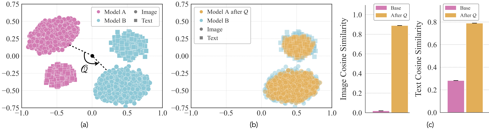
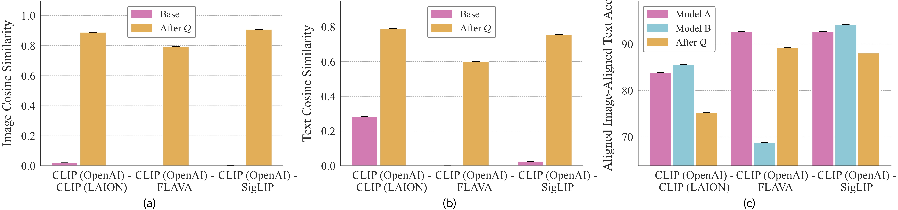

<div align="center">

<h1>Canonicalizing Multimodal Contrastive Representation Learning</h1>

#### [Project Page](https://canonical-multimodal.github.io/) | [Paper](https://arxiv.org/abs/2602.17584) | [Bibtex](#citation)

<div>
    <a href="https://www.mit.edu/~sharut" target="_blank">Sharut Gupta</a><sup>†,*</sup> | 
    <a href="https://www.linkedin.com/in/sanyam-kansal-247b521a4/" target="_blank">Sanyam Kansal</a><sup>‡,*</sup> | 
    <a href="https://people.csail.mit.edu/stefje/" target="_blank">Stefanie Jegelka</a><sup>†,§</sup> |
    <a href="https://web.mit.edu/phillipi/" target="_blank">Phillip Isola</a><sup>†</sup> |
    <a href="https://people.csail.mit.edu/vgarg/" target="_blank">Vikas Garg</a><sup>¶,◦</sup>
</div>
<br>
<div>
    <sup></sup><sup>†</sup> MIT CSAIL  <sup>‡</sup> IIT Kanpur <sup>§</sup> TU Munich <sup>¶</sup> Aalto University <sup>◦</sup> Yai Yai Ltd.
</div>
<div>
    <sup>*</sup> Equal Contribution
</div>
<br>


[](https://arxiv.org/abs/2602.17584)

---


<div align="left"> 

## Abstract
As models and data scale, independently trained networks often induce analogous notions of similarity. But, matching similarities is weaker than establishing an explicit correspondence between the representation spaces, especially for multimodal models, where consistency must hold not only within each modality, but also for the learned image–text coupling. We therefore ask: given two \emph{independently} trained multimodal contrastive models (with encoders $(f, g)$ and $(\tilde{f},\tilde{g})$)---trained on different distributions and with different architectures---does a systematic geometric relationship exist between their embedding spaces? If so, what form does it take, and does it hold uniformly across modalities? In this work, we show that across model families such as CLIP, SigLIP, and FLAVA, this geometric relationship is well approximated by an orthogonal map, i.e., there exists an orthogonal map $Q$ where $Q^\top Q = I$ such that, up to a global mean shift, $\tilde{f}(x)\approx Q f(x)$ for paired images $x$. Strikingly, the \emph{same} $Q$ simultaneously aligns the text encoders i.e., $\tilde{g}(y)\approx Q g(y)$ for texts $y$. Theoretically, we prove that if the multimodal kernel agrees across models on a small anchor set i.e. $\langle f(x), g(y)\rangle \approx \langle \tilde{f}(x), \tilde{g}(y)\rangle$, then the two models must be related by a \emph{single orthogonal map} $Q$ and the same $Q$ maps images and text across models. More broadly, this finding enables backward-compatible model upgrades, avoiding costly re-embedding, and has implications for the privacy of learned representations.



The key contributions of this work include:

- We show that independently trained multimodal contrastive models can be closely approximated by a *single orthogonal* map. Additionally, this map is shared across modalities, i.e., estimating the map from images alone aligns text, and vice versa.

- Theoretically, we prove that matching multimodal kernels on a small anchor set across two distinct models forces a shared orthogonal alignment across modalities and derive stability bounds in the approximate regime. 

- We validate these claims across five benchmarks and multiple model pairs, with extensive ablations showing that this map transfers across datasets without re-fitting and remains consistent under composition, yielding the most reliable cross-model, cross-modal transfer.


## Installation and Setup

1. Clone the repository
   ```bash
   git clone git@github.com:Sharut/canonical-multimodal-rep.git
   ```

2. Create a virtual environment and install the following dependencies:
   ```bash
   pip install torch torchvision
   pip install open-clip-torch
   pip install transformers
   pip install numpy tqdm Pillow
   ```

3. For datasets available through torchvision (e.g., Oxford-IIIT Pet, CIFAR-100, Caltech-101, DTD, STL-10), no additional setup is required; our scripts will download them automatically. If you’d like to cache the data in a specific location, set `--data_root` to the directory of your choice.

## Repository structure

This repository is organized as follows:


```
.
├── main.py         # Main training script for alignment
├── few_anchors.py  # alignment with a subset of data to test for generalization 
├── models.py       # Model class
├── datasets.py     # Dataset loaders
└── utils.py        # Metrics and other utility functions
```


## Datasets and benchmarks

All experiments use standard vision classification datasets with a fixed train/test split. Embeddings are cached under `../embeddings/{dataset}/{exp_id}/`. 

| Dataset        | Description                    | # Classes                                      |
|----------------|--------------------------------|--------------------------------------------|
| **Oxford**     | Oxford-IIIT Pet                | 37  |
| **CIFAR 100**  | CIFAR-100                      | 100 |
| **Caltech101** | Caltech-101                    | 101 |
| **DTD**        | Describable Textures (DTD)     | 47  |
| **STL10**      | STL-10                         | 10  |

Set `--data_root` to a directory of your choice; torchvision-based datasets (Oxford, CIFAR-100, Caltech-101, DTD, STL-10) download automatically when needed.


## Usage

### (A) Independently Trained Contrastive Models Differ by an Orthogonal Map Common To Both Modalities

Here, we align two independently trained multimodal contrastive models (e.g., two CLIP models, one trained on LAION and one by OpenAI with possibly different training distribution) using a **single orthogonal map** $Q \in O(d)$ that is shared across modalities.

```bash
python main.py --dataset oxford \
               --clip_model_1 ViT-B-32 --pretrained_1 openai \
               --clip_model_2 ViT-B-32 --pretrained_2 laion400m_e31 \
               --seeds 42,43,44
```
Results are saved to `./results/{dataset}/{exp_id}/` under `rotation/ `(rotation only, no centering) and `rotation_with_centering/` (with mean centering), each containing {dataset}_results.json with per-seed results and aggregated mean/std.


Results for the runs will be saved under `./results/{dataset}/{exp_id}/` in: - `rotation/` — rotation only (no centering)
  - `rotation_with_centering/` — with mean centering  
  Each folder contains `{dataset}_results.json` (per-seed and aggregated mean/std).

### (B) Only a Few Data Points Are Needed to Learn the Orthogonal Map
Here we evaluate how many points are needed to estimate $\mathcal{Q}$ while still maintaining good generalization to unseen data. We fit $\mathcal Q$ using paired images from only $N$ classes and then measure transfer performance on the remaining (unseen) classes. To run this script, use:
```bash
python few_anchors.py --dataset oxford \
                      --num_train_classes 15 \
                      --clip_model_1 ViT-B-32 --pretrained_1 openai \
                      --clip_model_2 ViT-B-32 --pretrained_2 laion400m_e31 \
                      --seeds 42,43,44 --class_split_seeds 42,43,44
```

Optional arguments: `--data_root`, `--batch_size`, `--num_workers`, `--single_prompt` (see `--help` for each script).

Results are saved to `./results/{dataset}/{exp_id}/few_anchors_N{n}/` (e.g., few_anchors_N15) using the same `rotation/` and `rotation_with_centering/` structure.


## Results



<a name="citation"></a>
## Citation
If you find this work useful in your research, please cite:
```
@inproceedings{sharut2026canonicalizing,
    title={Canonicalizing Multimodal Contrastive Representation Learning},
    author={Gupta, Sharut and Kansal, Sanyam and Jegelka, Stefanie and 
        Isola, Phillip and Garg, Vikas},
    journal={arXiv preprint arXiv:2602.17584},
    year={2026}
}

```
